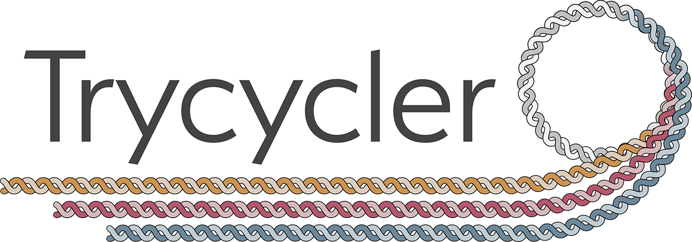

Trycycler is a tool for generating consensus long-read assemblies for bacterial genomes. I.e. if you have multiple long-read assemblies for the same isolate, Trycycler can combine them into a single assembly that is better than any of your inputs.

For installation instructions, usage, deeper explanations and more, head over to the [Trycycler wiki](https://github.com/rrwick/Trycycler/wiki)!

For our paper describing Trycycler, follow this link: [Wick RR, Judd LM, Cerdeira LT, Hawkey J, Méric G, Vezina B, Wyres KL, Holt KE. Trycycler: consensus long-read assemblies for bacterial genomes. Genome Biology. 2021. doi:10.1186/s13059-021-02483-z.](https://doi.org/10.1186/s13059-021-02483-z)

 
